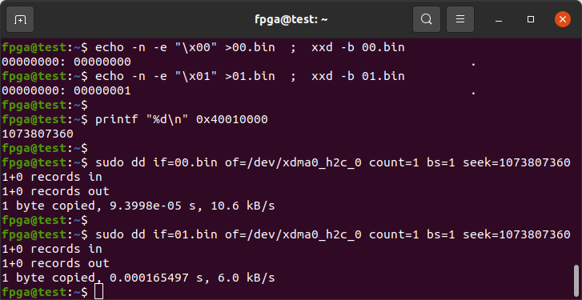
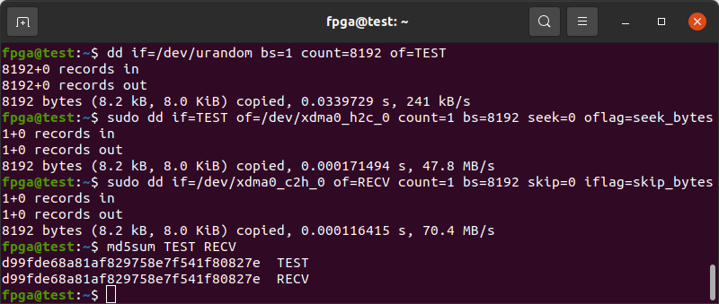
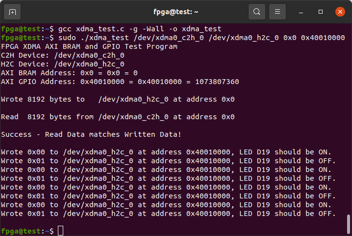

**Work-In-Progress**

# Innova-2 Flex Open VPI MNV303611A-EDLT Demo Project

[Vivado 2022.2](https://www.xilinx.com/support/download/index.html/content/xilinx/en/downloadNav/vivado-design-tools/2022-2.html) XDMA PCIe to BRAM and GPIO demo for the [XCKU15P FPGA](https://www.xilinx.com/products/silicon-devices/fpga/kintex-ultrascale-plus.html) on the [Innova-2 Flex Open VPI MNV303611A-EDLT](https://www.mellanox.com/files/doc-2020/pb-innova-2-flex.pdf).

I do not have a MNV303611A-EDLT I can test this project with so I tested it on a MNV303212A-ADLT. A user on the Nvidia SmartNIC Forum [successfully tested this project](https://forums.developer.nvidia.com/t/failed-to-burn-an-image-onto-innova-2-flex-fpga/254396/11).

Refer to the [innova2_flex_xcku15p_notes](https://github.com/mwrnd/innova2_flex_xcku15p_notes/) project for instructions on setting up an Innova-2 system with all drivers including [Xilinx's PCIe XDMA Drivers](https://github.com/Xilinx/dma_ip_drivers).

Refer to [this tutorial](https://github.com/mwrnd/notes/tree/main/Vivado_XDMA_DDR4_Tutorial) for detailed instructions on generating a similar project from scratch.


## Block Design


LED *D18* is connected to Pin B6 of the FPGA through an inverting buffer and this design connects it to the 30th bit of a counter connected to the 250MHz XDMA AXI Clock. It should blink at `250000000/2^30 ~= 0.233Hz` which is about every 4 seconds.


## AXI Addresses


## Testing the Design


Activate the *Flex Image* using `innova2_flex_app`, clone the repo, then [upload the bitstream](https://github.com/mwrnd/innova2_flex_xcku15p_notes#loading-a-user-image) onto your Innova-2 using `innova2_flex_app`.

```
git clone https://github.com/mwrnd/innova2_mnv303611a_xcku15p_xdma.git
cd innova2_mnv303611a_xcku15p_xdma

sha256sum *bin
echo SHA256 checksum of innova2_mnv303611a_xcku15p_xdma_primary.bin:
echo f90e8cc788a0da16019b8c6533c5036732dba3c22bbd33f6a113f54963b9d154
echo SHA256 checksum of innova2_mnv303611a_xcku15p_xdma_secondary.bin:
echo 83afccf8dddbee80700a7a36e55b531483d98492d93075575ab16e3d84125782

cd ~
sudo mst start
sudo mst status
sudo mst status -v
sudo flint -d /dev/mst/mt4119_pciconf0 q
cd ~/Innova_2_Flex_Open_18_12/driver/
sudo ./make_device
sudo insmod /usr/lib/modules/`uname -r`/updates/dkms/mlx5_fpga_tools.ko
cd ~

sudo ~/Innova_2_Flex_Open_18_12/app/innova2_flex_app -v  \
  -b innova2_mnv303611a_xcku15p_xdma_primary.bin,0       \
  -b innova2_mnv303611a_xcku15p_xdma_secondary.bin,1

```

After reboot, confirm the *User Image* is active with `sudo dmesg | grep -i xdma  ;  sudo lspci -vnn`:


## Test the AXI GPIO Block

This demo design has an LED under control of an [AXI GPIO Block](https://docs.xilinx.com/v/u/3.0-English/ds744_axi_gpio).

LED *D19* on the back of the board is connected to Pin A6 of the FPGA through an inverting buffer. The LED will be ON after reboot. Prepare files to read and write to the XDMA Block.
```
cd ~/dma_ip_drivers/XDMA/linux-kernel/tools/
echo -n -e "\xff" >ff.bin   ;   od -A x -t x1z -v  ff.bin
echo -n -e "\x00" >00.bin   ;   od -A x -t x1z -v  00.bin
```

Read from `0x40000000` which is the address of the `axi_gpio_0` block. Bit0 connects to the XMDA block's `user_lnk_up` signal and should be `1`. Bit1 connects to the LED. The LED is ON when this bit is `0` and OFF when it is `1`.
```
sudo ./dma_from_device --verbose --device /dev/xdma0_c2h_0 --address 0x40000000 --size 4 --file RECV ; xxd -b RECV
```

Write `0xff` to `0x40010000` which is the address of the `axi_gpio_1` block which has one output, the LED.
```
sudo ./dma_to_device   --verbose --device /dev/xdma0_h2c_0 --address 0x40010000 --size 1  -f    ff.bin
```

Read from `0x40000000` (`axi_gpio_0`) again. Bit1 should be `1` and LED *D19* should be OFF.
```
sudo ./dma_from_device --verbose --device /dev/xdma0_c2h_0 --address 0x40000000 --size 4 --file RECV ; xxd -b RECV
```

The output should be similar to:
```
dev /dev/xdma0_c2h_0, addr 0x40000000, aperture 0x0, size 0x4, offset 0x0, count 1
host buffer 0x1004, 0x562bd2547000.
#0: CLOCK_MONOTONIC 0.000030484 sec. read 4/4 bytes
** Avg time device /dev/xdma0_c2h_0, total time 30484 nsec, avg_time = 30484.000000, size = 4, BW = 0.131216 
/dev/xdma0_c2h_0 ** Average BW = 4, 0.131216
00000000: 11001101 00000000 00000000 00000000                    ....

dev /dev/xdma0_h2c_0, addr 0x40010000, aperture 0x0, size 0x1, offset 0x0, count 1
host buffer 0x1001 = 0x55f2354c7000
#0: CLOCK_MONOTONIC 0.000042889 sec. write 1 bytes
** Avg time device /dev/xdma0_h2c_0, total time 42889 nsec, avg_time = 42889.000000, size = 1, BW = 0.023316 
/dev/xdma0_h2c_0 ** Average BW = 1, 0.023316

dev /dev/xdma0_c2h_0, addr 0x40000000, aperture 0x0, size 0x4, offset 0x0, count 1
host buffer 0x1004, 0x560a5350e000.
#0: CLOCK_MONOTONIC 0.000091797 sec. read 4/4 bytes
** Avg time device /dev/xdma0_c2h_0, total time 91797 nsec, avg_time = 91797.000000, size = 4, BW = 0.043574 
/dev/xdma0_c2h_0 ** Average BW = 4, 0.043574
00000000: 11101011 00000000 00000000 00000000                    ....
```


## Communication Methods

The XDMA Driver ([Xilinx's dma_ip_drivers](https://github.com/xilinx/dma_ip_drivers)) creates [read-only and write-only](https://manpages.debian.org/bookworm/manpages-dev/open.2.en.html#File_access_mode) [character device](https://en.wikipedia.org/wiki/Device_file#Character_devices) files, `/dev/xdma0_h2c_0` and `/dev/xdma0_c2h_0`, that allow direct access to the FPGA design's AXI Bus. To read from an AXI Device at address `0x40010000` you would read from address `0x40010000` of the `/dev/xdma0_c2h_0` (Card-to-Host) file. To write you would write to the appropriate address of `/dev/xdma0_h2c_0` (Host-to-Card).

For example, to toggle the LED you can write to the appropriate address using [`dd`](https://manpages.debian.org/testing/coreutils/dd.1.en.html). Note `dd` requires numbers in Base-10 so you can use [`printf`](https://manpages.debian.org/testing/coreutils/printf.1.en.html) to convert from the hex address.
```
echo -n -e "\x00" >00.bin  ;  xxd -b 00.bin
echo -n -e "\x01" >01.bin  ;  xxd -b 01.bin
printf "%d\n" 0x40010000
sudo dd if=00.bin of=/dev/xdma0_h2c_0 count=1 bs=1 seek=1073807360
sudo dd if=01.bin of=/dev/xdma0_h2c_0 count=1 bs=1 seek=1073807360
```



You can also read or write to the AXI BRAM Memory.
```
dd if=/dev/urandom bs=1 count=8192 of=TEST
sudo dd if=TEST of=/dev/xdma0_h2c_0 count=1 bs=8192 seek=0 oflag=seek_bytes
sudo dd if=/dev/xdma0_c2h_0 of=RECV count=1 bs=8192 skip=0 iflag=skip_bytes
md5sum TEST RECV
```



[xdma_test.c](xdma_test.c) is a simple C program that writes then reads to the given AXI Address connected to BRAM and then toggles the LED.
```
gcc xdma_test.c -g -Wall -o xdma_test
sudo ./xdma_test /dev/xdma0_c2h_0 /dev/xdma0_h2c_0  0x0  0x40010000
```




## TODO


